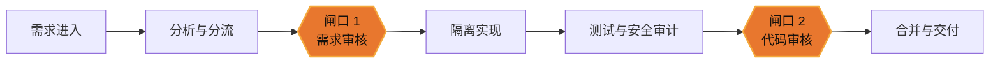

<p align="center">
  
</p>

<h1 align="center">AutoForge</h1>

<p align="center">
  <strong>一条你敢签字放行的自主软件产线。</strong><br />
  让一个人管理一支 AI 工厂，把人的判断力留给真正重要的决策。
</p>

<p align="center">
  <a href="https://github.com/vima-tech/AutoForge/actions/workflows/ci.yml"></a>
  <a href="https://github.com/vima-tech/AutoForge/releases/latest"></a>
  <a href="LICENSE"></a>
</p>

<p align="center">
  <a href="#产品理念">产品理念</a> ·
  <a href="#工作方式">工作方式</a> ·
  <a href="#核心能力">核心能力</a> ·
  <a href="#下载">下载</a> ·
  <a href="#快速开始">快速开始</a> ·
  <a href="#技术架构">技术架构</a> ·
  <a href="#参与贡献">参与贡献</a>
</p>

> [!NOTE]
> AutoForge 目前处于 **Alpha** 阶段，适合本地试用、产品验证与内部工作流探索，尚不建议未经评估直接接入关键生产仓库。

## 产品理念

### 软件交付，应该按需求计产，而不是按工时计价

从想法到上线，不该永远被「工程师工时 × 单价」所约束。AI 已经可以承担分析、实现、测试与交付中的大量机械工作；人类稀缺的判断力，应集中在两个问题上：

1. **要不要做？**——需求是否真实、可行、值得投入。
2. **做得对不对？**——代码、测试与风险是否达到合并标准。

AutoForge 不试图再做一个更聪明的聊天助手，而是把 Agent、工具、规则与审计串成一条可运行的软件产线。

| 自主运行 | 人类把关 | 本地优先 |
|:---|:---|:---|
| Agent 承担分析、编码、测试与交付编排 | 需求审核与代码审核是两道明确闸口 | 桌面端、SQLite、进程内调度，无需部署业务服务端 |
| 用流水线消化长尾 backlog | 最终合并权始终留在人手中 | 业务状态保存在本机，模型数据边界由所选 CLI/API 决定 |

## 工作方式



- **闸口 1 · 需求审核**：确认问题真实、范围清楚、方案值得执行。
- **闸口 2 · 代码审核**：对照变更摘要、Diff、测试与安全结果决定是否合并。
- **闸口之间 · 自主产线**：Agent 在隔离 worktree 中实现、验证、记录产物，并将结果送回审核队列。

## 核心能力

| 能力域 | AutoForge 提供什么 |
|:---|:---|
| 需求入口 | 快速录入、会议材料、GitHub / Webhook 接入、重复与优先级分析、AI 自动供料（系统自扫代码提需求） |
| 孵化台 | 将大型想法迭代为 PRD、规格与可执行任务，再统一送入需求池 |
| 多 Agent 协作 | IM 风格会议室、角色化 Agent、`@mention`、附件与项目上下文 |
| 自主实现 | 可插拔编码 Agent（claude / codex / opencode）在隔离 Git worktree 中执行，按风险分级选快/强模型 |
| 并发治理 | 会话槽位 + 按核 CPU 预算 + 依赖共享缓存，批量执行不拖垮本机 |
| 质量闸口 | 测试、代码 Diff、功能审计、安全审计与人工批准 |
| 可观测性 | 任务状态、Agent 输出、模型与工具调用链路、失败原因下钻 |
| 知识与扩展 | 项目规格、经验记忆、Skills 与 MCP Server 接入（会议归档自动蒸馏为长期知识） |

### 它和其他 AI 编码工具的差别

| 维度 | IDE Copilot | 云端自主 Agent | **AutoForge** |
|:---|:---|:---|:---|
| 人的角色 | 逐次驾驶 | 几乎不管 | 只守两个审核闸口 |
| 处理单位 | 一次编辑会话 | 一个任务 | 一条持续流水线（队列化、并发、自供料） |
| 运行位置 | 编辑器内 | 厂商云端 | 本地桌面应用，代码不出本机 |

AutoForge 不做"更聪明的单次执行"，而是做执行之上的**编排、治理与闭环**——
把你已有的编码 CLI 组织成有审批流、有安全边界、有记忆的生产系统。底层模型越强，
瓶颈越在治理与吞吐，这一层的价值随之增值。

## 为什么可以放手

安全不是产线末端的一项检查，而是整条产线的约束条件。

- **隔离执行**：每个变更在独立 worktree 中完成，避免直接污染主工作区。
- **Git 护栏**：代理层拦截危险操作，合并通过单一受控入口完成。
- **强制验证**：测试与安全审计作为流水线阶段留痕，而不是口头承诺。
- **输入防护**：外部需求、网页与工具返回值按不可信数据处理，检测明显 Prompt Injection。
- **完整追踪**：Agent、模型与工具调用关联到同一条 trace，便于定位结果从何而来。

## 下载

前往 [GitHub Releases](https://github.com/vima-tech/AutoForge/releases/latest)
下载 Windows、macOS 或 Linux 安装包。每个版本都附带 `SHA256SUMS.txt`，可用于校验下载文件完整性。

> [!IMPORTANT]
> AutoForge 目前是 Alpha 软件，能够调用本地编码 Agent、访问已配置仓库并连接外部模型或 MCP 服务。首次试用请使用可丢弃或已备份的仓库，并只授予必要凭据。

## 快速开始

### 前提条件

- [Rust](https://rustup.rs/) 1.88+
- Node.js 18+
- 已登录的本地 `claude` CLI，或在应用中配置可用的模型服务
- [Tauri 2 系统依赖](https://v2.tauri.app/start/prerequisites/)

### 安装系统依赖

<details>
<summary><strong>Fedora / RHEL</strong></summary>

```bash
sudo dnf install -y dbus-devel gtk3-devel webkit2gtk4.1-devel \
  openssl-devel libappindicator-gtk3-devel librsvg2-devel patchelf
```

</details>

<details>
<summary><strong>Ubuntu / Debian</strong></summary>

```bash
sudo apt install -y libdbus-1-dev libgtk-3-dev libwebkit2gtk-4.1-dev \
  libssl-dev libayatana-appindicator3-dev librsvg2-dev
```

</details>

<details>
<summary><strong>macOS</strong></summary>

```bash
xcode-select --install
```

</details>

### 本地运行

```bash
git clone https://github.com/vima-tech/AutoForge.git
cd AutoForge
npm ci
npm run tauri:dev
```

仅调试前端界面时，可以运行：

```bash
npm run dev
```

### 常用命令

| 命令 | 用途 |
|:---|:---|
| `npm run dev` | 启动 Vite 前端开发服务器 |
| `npm run build` | 执行 TypeScript 检查并构建前端 |
| `npm run tauri:dev` | 启动完整桌面应用开发环境 |
| `npm run tauri:build` | 构建桌面安装包 |

## 技术架构

| 层次 | 技术 |
|:---|:---|
| 桌面壳 | Tauri 2 |
| 前端 | React 18 · TypeScript · Vite 6 |
| 后端 | Rust · Tokio |
| 数据 | SQLite · 本地文件系统 |
| Agent | 本地 Claude CLI · 可配置 LLM · MCP · Skills |
| 工程隔离 | Git worktree · 受控合并入口 |

```text
src/                 React 页面、组件与设计系统（8 个页面，IPC 收口于 services/index.ts）
src-tauri/src/       Rust 运行时：agents/（AI 调用）· core/（基础设施）· tasks/（后台流水线）· commands/（IPC 薄壳）
src-tauri/migrations SQLite 数据模型演进（只增不改）
.autoforge/          项目工作区：docs / specs / deliverables 与 AI 指引
docs/                文档与品牌资产
```

后端业务核心（`agents/`、`core/`、`tasks/`、`models/`）是**纯 Rust、零 Tauri 类型依赖**——
Tauri 只是可替换的传输与壳层，为未来后端独立化（headless / 服务化）保留缝隙。

## 参与贡献

欢迎提交 Bug、文档改进和聚焦的功能变更。请先阅读
[贡献指南](CONTRIBUTING.md)；安全问题请按 [安全策略](SECURITY.md)
私下报告，不要创建公开 Issue。项目的集成分支是 `dev`，外部 Pull Request
也应以 `dev` 为目标分支。

## 开源协议

AutoForge 基于 [Apache License 2.0](LICENSE) 开源。该协议允许使用、修改与分发，
并包含明确的专利授权；项目名称和视觉标识不因代码许可而获得商标授权，详见 [NOTICE](NOTICE)。

---

<p align="center">
  <strong>AutoForge</strong> · Autonomous where it should be. Human-gated where it matters.
</p>

<p align="center"><sub>文档更新日期: 2026-08-12</sub></p>
